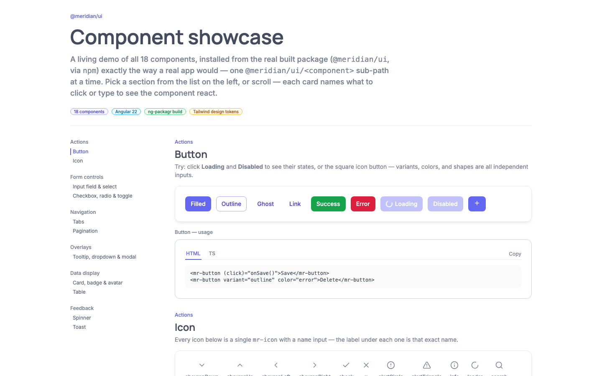

# Meridian

**An Angular design system, a live showcase for it, and a real-time app built with it.**



> **Live demo:** _add your Vercel/Netlify URL here_

Meridian is a token-driven Angular component library (`@meridian/ui`) with 18 accessible components, built to be consumed exactly like a published npm package. This repo holds the library, a documented showcase app, and a collaborative Kanban board that uses it.

| Folder | What it is |
|---|---|
| [`meridian-ui/`](meridian-ui) | The component library: 18 components, design tokens, Tailwind plugin, Jest tests, ng-packagr build |
| [`meridian-demo/`](meridian-demo) | The showcase app: every component with live examples and copy-paste HTML/TS usage. **Standalone** |
| [`meridian-kanban/`](meridian-kanban) | A real-time collaborative Kanban board (Angular client + Node WebSocket server) built on `@meridian/ui` |

## The design system

**Components (18):** button, icon, input field, select, checkbox, radio, toggle, tabs, tooltip, dropdown, modal, card, badge, avatar, pagination, table, spinner, toast.

- **Token-driven.** Colors, spacing, typography, radius and shadow live in one Tailwind config in two layers: raw palettes, then semantic aliases (`primary`, `error`, ...). Components only reference the semantic layer, never a hex value.
- **Typed variants.** Each component's styles come from [`tailwind-variants`](https://www.tailwind-variants.org/) with typed enums (variant, color, size, shape, status).
- **Accessible by default.** Built on Angular CDK: focus trapping and restoration in the modal, `FocusKeyManager` arrow-key navigation in the dropdown, real native inputs under the styled checkbox, radio and toggle, and ARIA wiring on form fields.
- **Forms-ready.** Input, select, checkbox, radio and toggle implement `ControlValueAccessor`, so they work with `[formControl]` and `ngModel`.
- **Tree-shakable.** Each component is its own entry point: `import { MrButton } from '@meridian/ui/button'`. The build produces 19 secondary entry points via `ng-packagr`.
- **Tested.** 169 Jest tests, plus real-browser Playwright passes that caught bugs unit tests could not (see below).

### Things browser testing caught
Building the showcase and the Kanban app against the real built package found bugs that `jest` and `ng-packagr` both passed over:
- A Tailwind plugin crash (`theme(...).join is not a function`) that meant the typography utilities had never actually been generated by a real build.
- An invisible spinner ring: `tailwind-variants` mis-grouped the library's word-keyed `border-md` width with border *colors* and silently dropped it.
- A modal crash when `<mr-modal [open]="true">` was instantiated already open, fixed in the library with a view-ready guard and a regression test.

## Run it

Each app has its own `package.json`; there is no monorepo tooling.

```bash
# Showcase (standalone: no other folder needed)
cd meridian-demo && npm install && npm start     # http://localhost:4200

# Library
cd meridian-ui && npm install
npm test                                         # Jest
npm run build                                    # ng-packagr -> dist/meridian-ui

# Kanban (two terminals)
cd meridian-kanban/server && npm install && npm run dev   # WebSocket server, :8787
cd meridian-kanban/client && npm install && npm start     # http://localhost:4200

# Kanban end-to-end test (boots both itself)
cd meridian-kanban/e2e && npm install && npx playwright install chromium && npm test
```

`meridian-kanban/client` installs the library from `dist/meridian-ui`, so run `npm run build` in `meridian-ui` first.

## Deploying the showcase

`meridian-demo` is a static Angular app with no backend.

| Setting | Value |
|---|---|
| Root directory | `meridian-demo` |
| Build command | `npm run build` |
| Output directory | `dist/meridian-demo/browser` |
| Install command | `npm ci` |

The built library and its token config are vendored inside `meridian-demo/vendor/`, which is what makes a fresh clone build on its own. After changing `meridian-ui`, rebuild it, re-copy `dist/meridian-ui` into `meridian-demo/vendor/meridian-ui`, and run `rm -rf node_modules/@meridian/ui && npm install` in the demo.

## Meridian Kanban

A real-time collaborative board: create or join a board by id, add and edit cards, drag cards between columns and reorder columns, and see other users' changes live.

- **Server-authoritative ordering.** The server stores each column as an ordered array of card ids, and every broadcast carries the full resolved order, never a delta. Applying the same event twice, or after a client's own optimistic guess, converges to the same state, so no CRDT is needed.
- **Optimistic UI.** The client applies changes immediately, confirms them by `clientEventId`, and does a full resync on reconnect.
- **Persistence.** Boards are stored in a single SQLite file (Node's built-in `node:sqlite`).
- **Tested at three levels.** A client reconciler unit test suite, a server convergence test over real WebSocket connections, and a Playwright test with two real browser contexts dragging a card and asserting it moves in both.

## Stack

Angular 22 · TypeScript · Tailwind CSS · Angular CDK · tailwind-variants · ng-packagr · Jest · Vitest · Playwright · Node · WebSockets (`ws`) · SQLite
